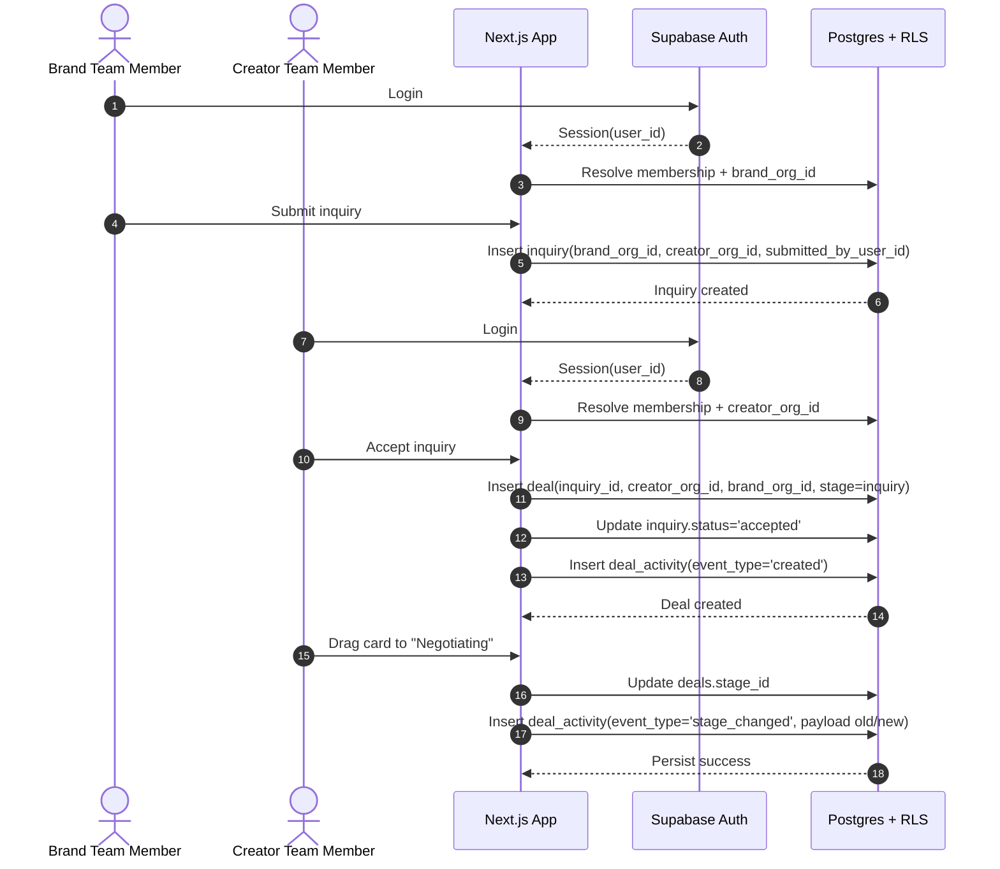
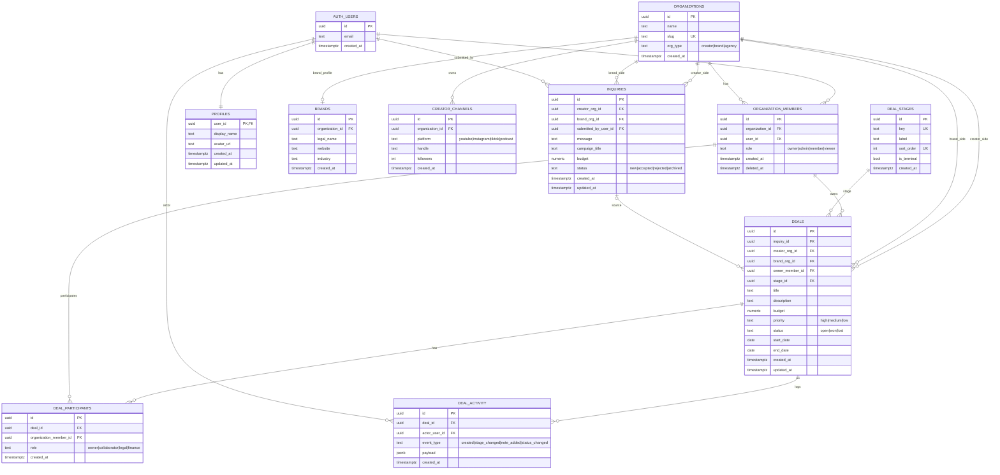

# Database Design Diagrams (V2)

## Sequence Diagram

```mermaid
sequenceDiagram
    autonumber
    actor BrandUser as Brand Team Member
    actor CreatorUser as Creator Team Member
    participant FE as Next.js App
    participant Auth as Supabase Auth
    participant DB as Postgres + RLS

    BrandUser->>Auth: Login
    Auth-->>FE: Session(user_id)
    FE->>DB: Resolve membership + brand_org_id

    BrandUser->>FE: Submit inquiry
    FE->>DB: Insert inquiry(brand_org_id, creator_org_id, submitted_by_user_id)
    DB-->>FE: Inquiry created

    CreatorUser->>Auth: Login
    Auth-->>FE: Session(user_id)
    FE->>DB: Resolve membership + creator_org_id

    CreatorUser->>FE: Accept inquiry
    FE->>DB: Insert deal(inquiry_id, creator_org_id, brand_org_id, stage=inquiry)
    FE->>DB: Update inquiry.status='accepted'
    FE->>DB: Insert deal_activity(event_type='created')
    DB-->>FE: Deal created

    CreatorUser->>FE: Drag card to "Negotiating"
    FE->>DB: Update deals.stage_id
    FE->>DB: Insert deal_activity(event_type='stage_changed', payload old/new)
    DB-->>FE: Persist success
```

## Entity Relationship Diagram

```mermaid
erDiagram
    AUTH_USERS {
      uuid id PK
      text email
      timestamptz created_at
    }

    ORGANIZATIONS {
      uuid id PK
      text name
      text slug UK
      text org_type "creator|brand|agency"
      timestamptz created_at
    }

    ORGANIZATION_MEMBERS {
      uuid id PK
      uuid organization_id FK
      uuid user_id FK
      text role "owner|admin|member|viewer"
      timestamptz created_at
      timestamptz deleted_at
    }

    PROFILES {
      uuid user_id PK, FK
      text display_name
      text avatar_url
      timestamptz created_at
      timestamptz updated_at
    }

    BRANDS {
      uuid id PK
      uuid organization_id FK
      text legal_name
      text website
      text industry
      timestamptz created_at
    }

    CREATOR_CHANNELS {
      uuid id PK
      uuid organization_id FK
      text platform "youtube|instagram|tiktok|podcast"
      text handle
      int followers
      timestamptz created_at
    }

    INQUIRIES {
      uuid id PK
      uuid creator_org_id FK
      uuid brand_org_id FK
      uuid submitted_by_user_id FK
      text message
      text campaign_title
      numeric budget
      text status "new|accepted|rejected|archived"
      timestamptz created_at
      timestamptz updated_at
    }

    DEAL_STAGES {
      uuid id PK
      text key UK
      text label
      int sort_order UK
      bool is_terminal
      timestamptz created_at
    }

    DEALS {
      uuid id PK
      uuid inquiry_id FK
      uuid creator_org_id FK
      uuid brand_org_id FK
      uuid owner_member_id FK
      uuid stage_id FK
      text title
      text description
      numeric budget
      text priority "high|medium|low"
      text status "open|won|lost"
      date start_date
      date end_date
      timestamptz created_at
      timestamptz updated_at
    }

    DEAL_ACTIVITY {
      uuid id PK
      uuid deal_id FK
      uuid actor_user_id FK
      text event_type "created|stage_changed|note_added|status_changed"
      jsonb payload
      timestamptz created_at
    }

    DEAL_PARTICIPANTS {
      uuid id PK
      uuid deal_id FK
      uuid organization_member_id FK
      text role "owner|collaborator|legal|finance"
      timestamptz created_at
    }

    AUTH_USERS ||--|| PROFILES : has
    AUTH_USERS ||--o{ ORGANIZATION_MEMBERS : joins
    ORGANIZATIONS ||--o{ ORGANIZATION_MEMBERS : has
    ORGANIZATIONS ||--o| BRANDS : brand_profile
    ORGANIZATIONS ||--o{ CREATOR_CHANNELS : owns
    ORGANIZATIONS ||--o{ INQUIRIES : creator_side
    ORGANIZATIONS ||--o{ INQUIRIES : brand_side
    AUTH_USERS ||--o{ INQUIRIES : submitted_by
    ORGANIZATIONS ||--o{ DEALS : creator_side
    ORGANIZATIONS ||--o{ DEALS : brand_side
    ORGANIZATION_MEMBERS ||--o{ DEALS : owns
    DEAL_STAGES ||--o{ DEALS : stage
    INQUIRIES o|--o{ DEALS : source
    DEALS ||--o{ DEAL_ACTIVITY : logs
    AUTH_USERS ||--o{ DEAL_ACTIVITY : actor
    DEALS ||--o{ DEAL_PARTICIPANTS : has
    ORGANIZATION_MEMBERS ||--o{ DEAL_PARTICIPANTS : participates
```
